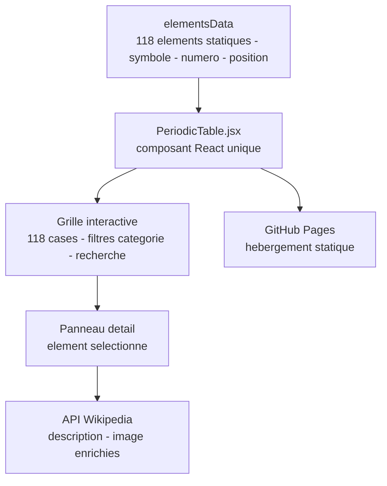

# Mendelieve.io

<!-- adam-badges:start -->
    
<!-- adam-badges:end -->

Application web interactive du tableau periodique de Mendeleiev.

**Live** - https://adam-blf.github.io/Mendelieve.io/

## Architecture

---

 

  

## 📝 Description
Projet web Mendelieve.io.

## ⚡ Fonctionnalités
- Site web
- Interface utilisateur

### Construit avec les outils et technologies : 

🇫🇷 Français | 🇬🇧 Anglais | 🇪🇸 Espagnol | 🇮🇹 Italien | 🇵🇹 Portugais | 🇷🇺 Russe | 🇩🇪 Allemand | 🇹🇷 Turc

---

  Par <a href="https://adam.beloucif.com">Adam Beloucif</a> - Data Engineer & Fullstack Developer - <a href="https://github.com/Adam-Blf">GitHub</a>

## Star History

<a href="https://www.star-history.com/?repos=Adam-Blf%2FMendelieve.io&type=date&legend=top-left">
 <picture>
   <source media="(prefers-color-scheme: dark)" srcset="https://api.star-history.com/chart?repos=Adam-Blf/Mendelieve.io&type=date&theme=dark&legend=top-left" />
   <source media="(prefers-color-scheme: light)" srcset="https://api.star-history.com/chart?repos=Adam-Blf/Mendelieve.io&type=date&legend=top-left" />
   
 </picture>
</a>
